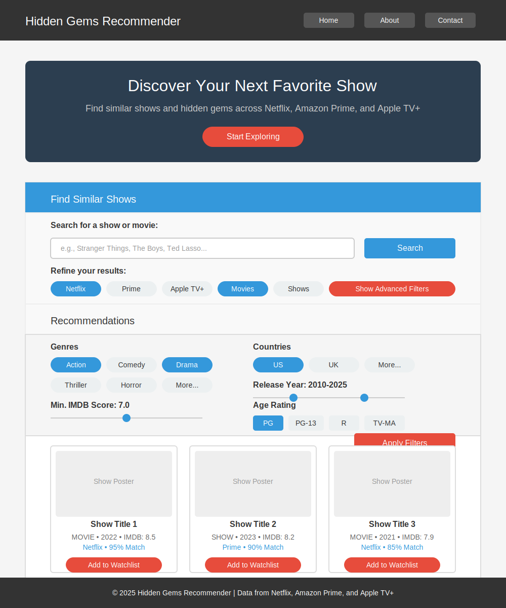

# TV Shows and Movies Recommender Project

**Inspiration**: As a developer myself, I have been binge watching tv shows and movies. One day, I began to struggle finding something NEW to watch. I realized people around me may be on the same boat. That’s why I invented this recommender system to target the “hidden-gem shows” on mainstream platforms

**Product**: A content-based filtering engine that generates a list of show recommendations based on user inputs like a past show they watched, ages, genres, and production countries

## Frontend Programs

### Website wireframe (main dashboard)

## Backend Programs

### preprocessing.py

1. **Datasets**: [Amazon Prime](https://www.kaggle.com/datasets/dgoenrique/amazon-prime-movies-and-tv-shows), [Netflix](https://www.kaggle.com/datasets/dgoenrique/netflix-movies-and-tv-shows), and [AppleTV+](https://www.kaggle.com/datasets/dgoenrique/apple-tv-movies-and-tv-shows) Movies and TV Shows in [Kaggle](https://www.kaggle.com/code/dgoenrique/a-simple-movie-tv-show-recommendation-system)

- All uses a CC0 License → Can use freely

2. Cleaning/Transforming Dataframes

- Drop all the duplicate and redundant columns
- Apply **One-Hot Encoding + Z-score normalization** on remaining columns (works well on list-based & categorical columns too)

3. Save data into the joblib library

- Optimizes performance bc we don’t have to parse them in every run

### model.py

ML Model used: [K-Nearest-Neighbors](https://www.datacamp.com/tutorial/k-nearest-neighbor-classification-scikit-learn) with [Cosine Similarity](https://memgraph.com/blog/cosine-similarity-python-scikit-learn)

- Use Case: For datasets with structured features (e.g., genre, artist, year for music recommendation), which is a YES!
- How it Works: Finds the k most similar items based on **a given title and/OR user preferences**

4. Load data into the engine
5. Feed the Model with cosine similarity of the Transformed Dataframe
6. Recommendation Generation:

- **For a given title**: retrieves the most similar ones from the dataset.
- Applies **filtering** such as min_year, genre, min_imdb to narrow results

## Next Steps

1. Consider using a movie/tv show API so we can apply this recommender system to every movie, instead of a limited dataset

- Add functionality to the recommender: make predictions on unseen data (not limited to existing dataset)

2. Evaluate the model using [MAP@K](https://www.evidentlyai.com/ranking-metrics/mean-average-precision-map#mean-average-precision-map) algorithm

- Ensures users will use the high-rated products first

3. Deploy product into a website
